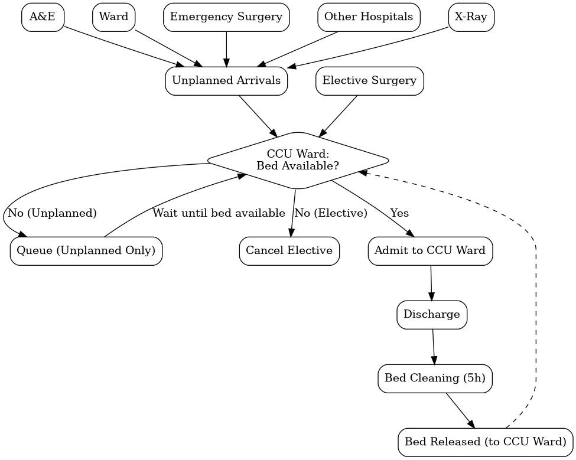

# Critical Care Unit DES Simulation

A discrete-event simulation project for modelling patient flow and bed usage in a Critical Care Unit (CCU), inspired by Griffiths et. al (2010)



## Repository structure

```text
Discrete-Event-Sim/
├── Group Portfolio/
├── analysis/
 ├── output_analysis.ipynb
├── binder/
 ├── environment.yml
├── distribution/
 ├── bin.csv
 ├── distributions.py
 ├── empirirical.py
 ├── empirical_freq.ipynb
├── model/
 ├── CriticalCareUnit.py
 ├── basic_model.ipynb
├── test/
 ├── pytest_ccu.py
├── README.md
├── setup.py
└── test.pdf
```
---

- **Output Analysis** in `analysis/`
- **Distributions for Modelling IAT and Stay Time** in `distribution/`
- **Critical Care Unit Model (basic) and (prepared for warm-up)** in `model/`
- **Testing of the functionalities** in `test/`, 

### `analysis/`
This folder contains outputs used to inspect model behaviour and present results.

#### `analysis/output_analysis.ipynb`
A Jupyter notebook to run the output analysis. 

---

### `binder/`
This folder supports reproducible execution in Binder/Jupyter environments.

#### `binder/environment.yml`
A Conda environment definition named `hds_stoch`. It pins Python `3.11.13` and includes the modelling and analysis stack needed for the project, including `simpy`, `sim-tools`, `scipy`, `scikit-learn`, `statsmodels`, `plotly`, and test dependencies such as `pytest`.

---

### `distribution/`
This folder contains reusable distribution code and empirical data used by the CCU model.

#### `distribution/bin.csv`
.csv file from WebPlusDigitizer including bins and heights from the empirical distribution (IAT) from Griffiths et. al (2010) 

#### `distribution/distributions.py`
Helper module defining all of the distributions from the paper. 

#### `distribution/empirical.py`
This notebook contains the Python file to allow the creation of Empirical Distribution to be ran. 

#### `distribution/empirical_freq.ipynb`
Notebook used to derive the empirical distribution stored in `bin.csv`.

 
---

### `model/`
This is the core of the repository and contains the full CCU simulation model

#### `model/CriticalCareUnit.py`
Main simulation module. This file implements the CCU model itself using **SimPy** and includes scenario setup, patient behaviour, replication helpers, and warm-up analysis tools.

#### `model/CriticalCareUnit.ipynb`
This was the first iteration of the model. If you do not wish to run the complex analysis and just want to run the simple model, you may run this notebook 


---

### `test/`
This folder contains a pytest file to test the basic logic within our model works. 

#### `test/__init__.py`
Empty package marker file for the test package.

#### `test/bin.csv`
To allow 

#### `test/pytest_ccu.py`
Testing file for CCU functionalities
- more beds reduce queue length,
- more beds reduce waiting time,
- more beds do not increase utilisation under the same demand,
- very large bed capacity leads to zero queue and zero wait,
- zero beds raises an error, and
- high unplanned demand increases planned-patient cancellations.

  #### MORE TEST INSTRUCTION IS ON test.pdf

  Thank you :)

---
